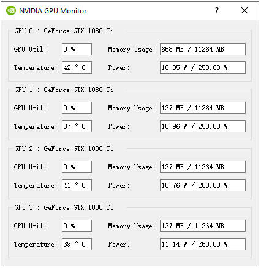
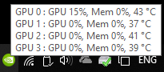
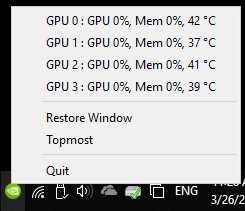

GPUMonitor
==========

This application is used to display NVIDIA GPUs' information, including device memory usage, GPU utilization, power and temperature.

These status can also be seen in the system tray and right-click menu.

These useful information of GPU comes from **'nvidia-smi'** command which is opened by **popen()** function. So, it dose **NOT** support **Interl** and **AMD** graphics card.
